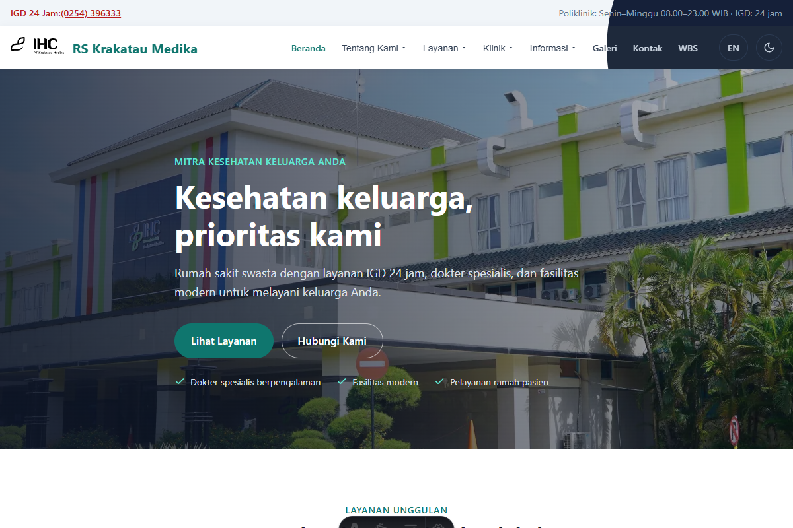

# RS Krakatau Medika — Company Profile

Situs profil perusahaan RS Krakatau Medika (RSKM), dibangun dengan **Astro 7**
(statis, Content Layer API) dan **Bun**. Bilingual Indonesia/Inggris dengan
routing `id` tanpa prefix dan `en` ber-prefix `/en` — siap dideploy di root,
subdomain, subfolder, maupun kombinasi (`ASTRO_SITE` + `ASTRO_BASE`).

## Preview



## Prasyarat

- Node >= 22.12.0
- [Bun](https://bun.sh) (manajer paket & runtime)

## Memulai

```sh
bun install

# Siapkan env (lihat .env.example untuk penjelasan tiap var):
cp .env.example .env.development   # untuk `astro dev`
cp .env.example .env.production    # untuk `astro build`
```

Variabel env yang dikenali: `ASTRO_SITE` (URL absolut untuk sitemap/canonical),
`ASTRO_BASE` (base path untuk deploy subfolder), dan opsional `PUBLIC_API_URL`
(URL absolut backend — hanya diperlukan bila backend di domain terpisah atau
untuk fetch build-time).

## Perintah

| Command | Aksi |
| :--- | :--- |
| `bun dev` | Jalankan dev server di `localhost:4321` |
| `bun build` | Build produksi ke `./dist/` |
| `bun preview` | Pratinjau hasil build secara lokal |
| `bun check` | Lint + format-check + `astro check` (gabungan) |
| `bun lint` | ESLint |
| `bun format` | Prettier (tulis ulang) |
| `bun typecheck` | TypeScript `tsc --noEmit` |
| `bun check:astro` | `astro check` |
| `bun astro ...` | CLI Astro lainnya (mis. `astro add`) |

## Struktur Ringkas

```text
/
├── public/              # favicon, manifest, ikon (asset statis)
├── src
│   ├── assets/          # gambar yang diproses astro:assets
│   ├── components/      # komponen (shared, sections, pages, blog, ui)
│   ├── content/         # koleksi konten (blog *.md / *.en.md)
│   ├── data/            # data statis SOT (site, nav, layanan, klinik, dll)
│   ├── i18n/            # kamus & helper locale (t, localePath, basePath)
│   ├── layouts/         # BaseLayout + layout halaman
│   ├── lib/             # logika SOT (routes, api, form, blog)
│   ├── loaders/         # loader Content Layer (blogLoader)
│   ├── pages/           # rute halaman (+ robots.txt)
│   ├── services/        # fasad akses data konten
│   ├── styles/          # design tokens & global CSS
│   └── content.config.ts # definisi koleksi
├── docs/STRUCTURE.md    # arsitektur lengkap, konvensi & aturan modul
└── astro.config.mjs     # site/base dari env, i18n, sitemap, kompresi
```

## Dokumentasi

- `docs/STRUCTURE.md` — peta modul, Single Source of Truth, aturan routing
  & fetch, konvensi bilingual.
- `AGENTS.md` — alur pengembangan & perintah dev server.

## Lisensi

Proprietary — **All Rights Reserved**. Tidak ada lisensi untuk menyalin,
mendistribusikan, atau memodifikasi tanpa izin tertulis. Lihat berkas
`LICENSE`. Permintaan izin: info@krakataumedika.co.id